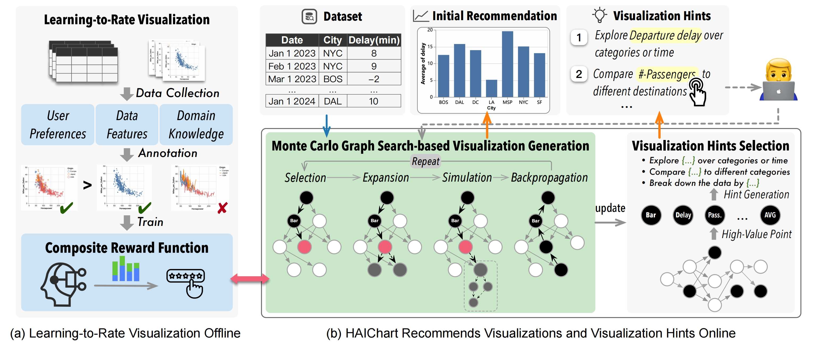

# HAIChart



## Overview

**HAIChart** combines human insights and AI capabilities through reinforcement learning to enhance data visualization processes. This innovative system supports users with high-quality visualization recommendations and hints for interactive exploration, leveraging a two-part framework: the offline learning-to-rate component and the online multi-round recommendations.

- **Offline Learning**: Focuses on understanding and rating visualizations by training a neural network on a vast dataset of visualizations with their ratings.
- **Online Recommendations**: Uses a Monte Carlo Graph Search (MCGS)-powered agent to offer promising visualizations and hints, encouraging exploratory user interaction.

## File Structure
- `datasets` contains the datasets used in this project, including VizML and KaggleBench.
- `static` houses web resources used by the project.
- `templates` includes the source code for the frontend interaction interface.
- `tools` folder contains components that organize this project, such as `features.py`, `instance.py`, etc.
- `user_model` folder holds the implementation code for the user model, including `discriminator.py`, `agent.py`, and more.
- `mcgs.py` is the implementation code for visualization generation and recommendation based on Monte Carlo Graph Search.

## Environment Setup
To set up the environment for HAIChart, ensure you have Anaconda installed and then follow these steps:

1. **Create and activate a new environment:**
```
conda create -n haichart python=3.6.13
conda activate haichart
```

2. **Install the necessary packages:**
```
pip install -r requirements.txt
```

## Contact
If you have any questions, please contact:  
yxie740@connect.hkust-gz.edu.cn
